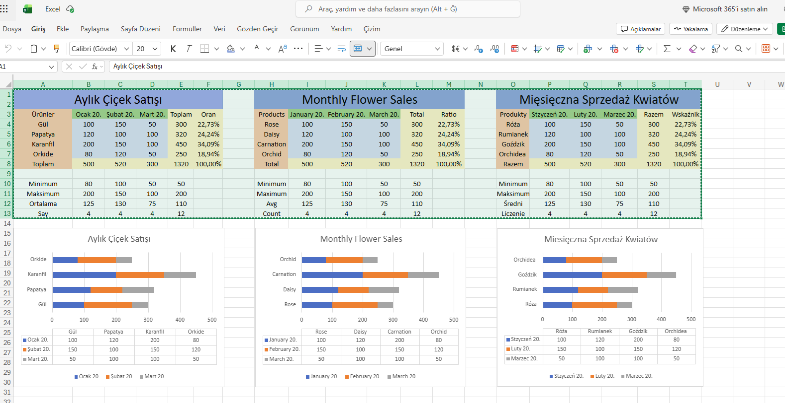
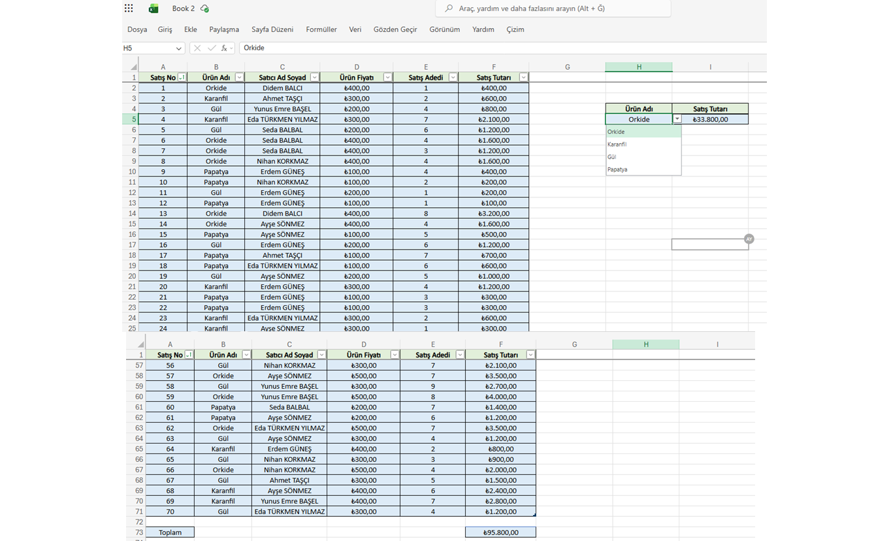
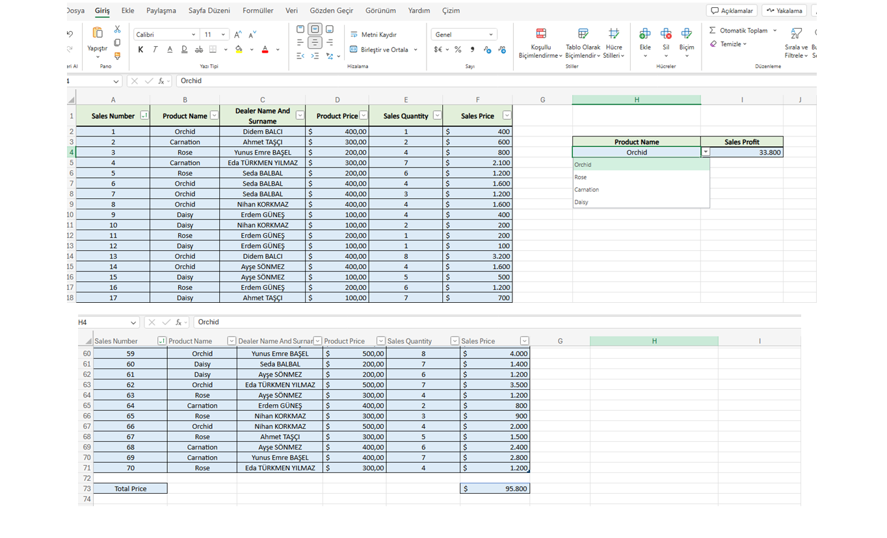
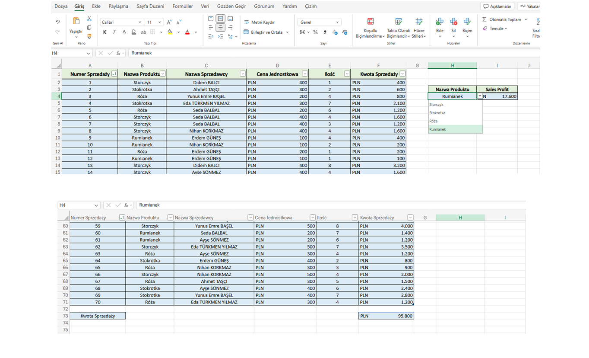

# IT-Consultant-Portfolio

SQL, Excel and VBA projects for data analysis and reporting
This repository contains my \*\*SQL, Excel, and VBA\*\* projects prepared for the \*\*Junior IT Consultant\*\* position.  

\*\*SQL projects\*\* are developed on the \*\*AdventureWorksDW2022\*\* database (Microsoft's sample data warehouse for reporting and analysis).  

\*\*Excel and VBA projects\*\* include sample business reports (e.g., sales analysis, customer segmentation) with \*\*multilingual support\*\*.

\*\*All reports and documentation are available in English, Turkish, and Polish\*\* to support international teams and clients (Israel, Poland, Turkey).

## 📁 Project Structure

\- \*\*`/SQL`\*\* – Scenario-based SQL queries (`JOIN`, `GROUP BY`, `Window Functions`, Subqueries) on AdventureWorksDW2022

\- \*\*`/EXCEL`\*\* – Excel reports (pivot tables, charts, formulas) in \*\*EN / TR / PL\*\*

\- \*\*`/VBA`\*\* – VBA automation scripts (one-click refresh, pivot table update)

\- \*\*/images\*\* – Screenshots of reports and dashboards

\---

## 🌐 Languages Used

Language : Turkish, Polish , English

## 📊 Sample Excel Report: Monthly Flower Sales

> \*Note: This is a standalone Excel example to demonstrate my reporting and multilingual skills. It is not part of the AdventureWorksDW2022 database.\*

\*\*Business problem:\*\* Analyze monthly flower sales to calculate product-based totals and percentages.

### 📸 Screenshot

### 📁 Excel File

\[Download Excel Report (EN/TR/PL)] ([https://1drv.ms/x/c/0a8adfaceb1dc513/IQAC6wfshuh4TqI\_rltbEJ6vASRfiHCgmS9Ca37ReP154Ts?e=yrk0rk](https://1drv.ms/x/c/0a8adfaceb1dc513/IQAC6wfshuh4TqI_rltbEJ6vASRfiHCgmS9Ca37ReP154Ts?e=yHmxjO))

### 🔧 Excel Features Used

\- Total (`SUM`) and Percentage calculations

\- Absolute cell references (`$E$6`)

\- Min, Max, Average, Count (`MIN`, `MAX`, `AVERAGE`, `COUNT`)

########################################################################################################################################################################################                               

## 🌸 Flower Sales Report (Multilingual)

## 📁 Excel Report – Key Features

- **SUBTOTAL Function:** Dynamic totals that respect filters.
- **Data Filtering:** Quick listing by product, seller, or sales amount.
- **Multilingual Support:** Turkish, English, and Polish versions available in **one Excel file (3 sheets)**
- **Sales Calculation:** `Total Amount = Unit Price × Quantity`.

### 🔍 Review

- [Multilingual Sales Report (TR/EN/PL)] (https://1drv.ms/x/c/0a8adfaceb1dc513/IQCFzHQ8LJgAQrZb8zmN9saEAcqvwFr6gupo-6zxydHqoS4?e=yF2suQ)

### 📸 Screenshots

## 🔍 Data Filtering & Listing

The report includes **AutoFilter** (`Ctrl + Shift + L`) to list data dynamically by product, seller, or price range.

**What you can do:**
- Filter by **Product Name** (Rose, Orchid, Daisy, Carnation)
- Filter by **Seller Name**
- Filter by **Sales Amount** (greater than, less than, between)

**Benefits:**
- Quick data exploration without changing the original table.
- Dynamic listing for customer or manager presentations.
